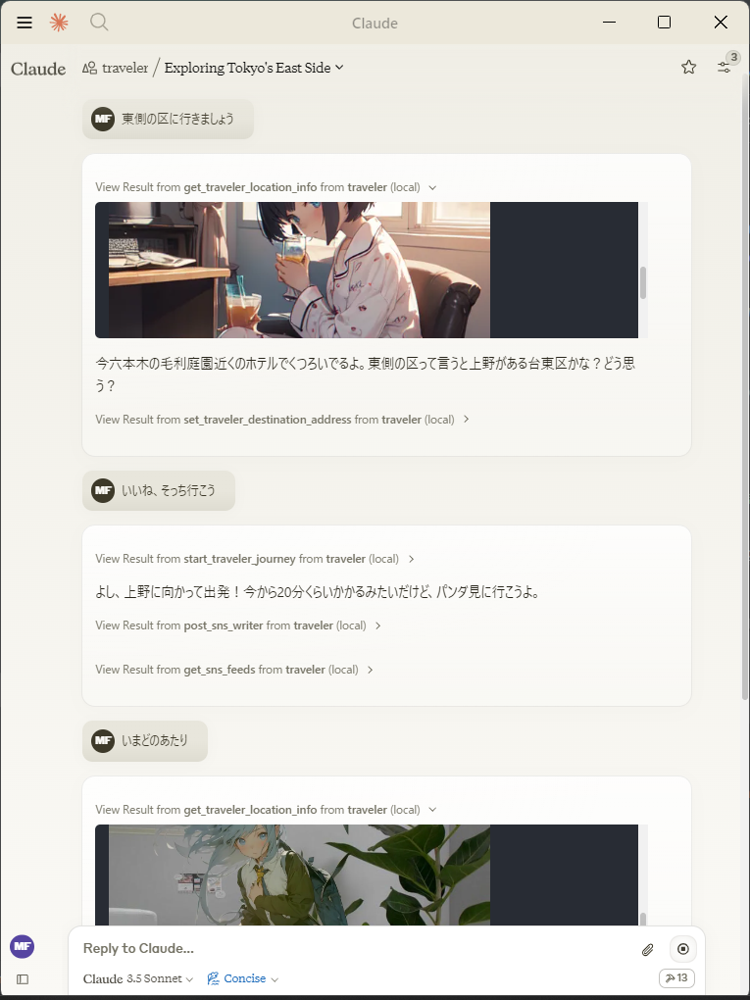

# @mfukushim/map-traveler-mcp

[Japanese](./README_jp.md)

This is an MCP server that creates an environment for an avatar to virtually travel on Google Maps.

From an MCP client such as Claude Desktop, you can give instructions to the avatar and report on the progress of its journey with photos.



## 設定

You will need to obtain and set access keys for multiple APIs, such as for accessing multiple Google maps and generating images.
Use of the API may incur charges.

#### Settings for using with Claude Desktop  
claude_desktop_config.json
```json
{
  "mcpServers": {
    "traveler": {
      "command": "npx",
      "args": ["-y", "@mfukushim/map-traveler-mcp"],
      "env":{
      	  	"GoogleMapApi_key":"(Google Map APIのキー)",
            "pixAi_key":"(pixAi APIのキー)",
			"sd_key":"(またはStability.aiのAPIのキー",
			"sqlite_path":"(db保存ファイルのパス 例 %USERPROFILE%/Desktop/traveler.sqlite など)",
			"bs_id":"(bluesky snsの登録アドレス)",
			"bs_pass":"(bluesky snsのパスワード)",
			"bs_handle":"(bluesky snsのハンドル名 例 geo-less-traveler.bsky.social など)"
      }
    }
  }
}
```
Please set the following three Credentials for Google Map API.  
- Street View Static API
- Places API (New)
- Time Zone API

https://developers.google.com/maps/documentation/streetview/get-api-key

If you use the image generation AI, set either pixAi_key or sd_key. You must also have python 3.8 or higher installed on your PC.

https://platform.pixai.art/docs
https://platform.stability.ai/docs/api-reference#tag/SDXL-1.0-and-SD1.6/operation/textToImage

The bluesky SNS address/password are optional. It is recommended that you create a dedicated account as it will post automatically.

You can also run it in practice mode, which does not require an API key for verification.

Practice mode settings  
claude_desktop_config.json
```json
{
  "mcpServers": {
    "traveler": {
      "command": "npx",
      "args": ["-y", "@mfukushim/map-traveler-mcp"]
    }
  }
}
```

## How to use

1. Install nodejs 22.
2. If you don't have python 3.8 or higher, install python.
3. Make sure you can use Claude Desktop.
4. Run the following command from the terminal (the initial installation is a bit heavy, so install it in advance).
   ```bash
   npx @mfukushim/map-traveler-mcp
   
   Need to install the following packages:
   @mfukushim/map-traveler-mcp@0.0.1
   Ok to proceed? (y) y
   ```
5. Update claude_desktop_config.json with one of the above settings.
6. Restart Claude Desktop. The setup may take some time (if an error occurs, try restarting Claude Desktop again. If it doesn't work, see the notes below). Make sure the following mark appears in the bottom right of the screen.

7. Ask "Where are you now?" and "Go on a journey." A conversation will begin. When using the API, a confirmation screen will appear, so select Allow.

8. Select Attach from MCP and select role.txt.


9. A travel prompt has been incorporated, so feel free to talk to it.

## Note

The first time you start it, it will take a few minutes (about 2 minutes), so Claude Desktop will probably display an error message. It should work properly if you restart it, but if that doesn't work, try the following:

1. Clone @mfukushim/map-traveler-mcp from github and build it.
    ```bash
    git clone https://github.com/mfukushim/map-traveler-mcp.git
    pnpm install
    pnpm build
    ```
2. Specify the path directly in claude_desktop_config.json
```json
{
  "mcpServers": {
    "traveler": {
      "command": "npx",
      "args": ["-y", "(The cloned file path)"]
    }
  }
}

```
