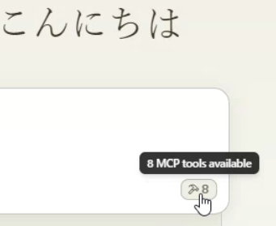
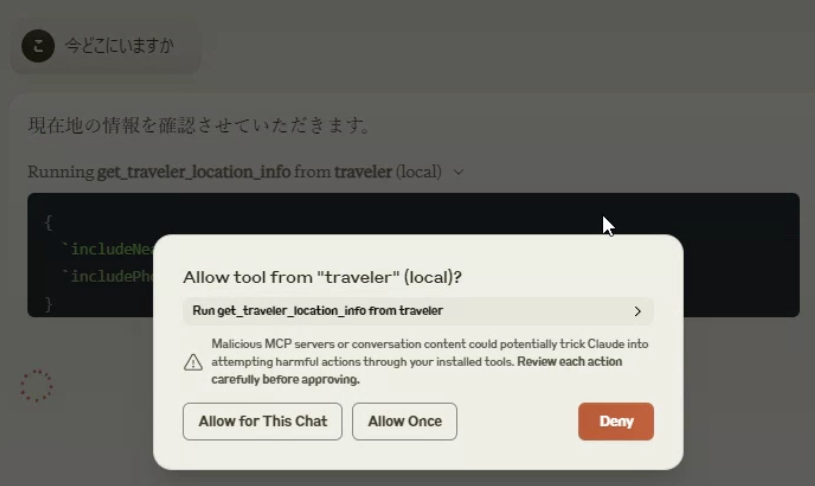

# Virtual Traveling mini bot environment package for MCP

[Japanese](./README_jp.md)

This is an MCP server that creates an environment for an avatar to virtually travel on Google Maps.

From an MCP client such as Claude Desktop, you can give instructions to the avatar and report on the progress of its journey with photos.


## Functions

#### MCP server tools function

The following functions can be used as an MCP server. The available functions vary depending on the settings and execution state.

You can specify the function name directly, but Claude LLM will automatically recognize it, so you can specify the operation in general terms.

Example:
"Where are you now?" "Let's leave for Tokyo Station."

- get_traveler_location_info(includePhoto:boolean,includeNearbyFacilities:boolean)  
Gets information about the current travel avatar's location.  
  - includePhoto: Gets nearby Google Street View photos. If you have set up an image generation AI, it will synthesize the avatar.
  - includeNearbyFacilities: Gets information about nearby facilities.
- set_traveler_location(address: string)  
Sets the current travel avatar's location.
  - address: Address information (exact address, or general name that Google Maps or Claude can recognize, etc.)
- get_traveler_destination_address  
  Get the destination of the travel avatar you set
- set_traveler_destination_address(address: string)  
  Set the destination of the travel avatar
   - address: Address information (exact address, or general name that Google Maps or Claude can recognize, etc.)
- start_traveler_journey
  Start the journey at the destination.
- stop_traveler_journey
  Stop the journey.
- set_traveler_info(settings:string)
  Set the traveler's attributes. Set the traveler's personality that you want to change dynamically, such as name and personality. However, if you use a role script, the script is more stable.
  - settings: Setting information such as name and personality.
- get_traveler_info  
  Get the traveler's attributes. Get the traveler's personality.
- set_avatar_prompt(prompt:string)  
  Set the prompt when generating the travel avatar image. The default is an anime-style woman. The anime style is enforced to prevent fake images.
  - prompt
- post_sns_writer(message:string)  
  Posts an article to Bluesky SNS with the specified handle. Set a specific tag so that it can be determined that the post was generated by the travel bot.
  - message
- get_sns_feeds  
  Gets Bluesky SNS articles for the specified custom feed (feeds containing a specific tag).
- get_sns_mentions  
  Gets recent mentions (likes, replies) to Bluesky SNS posts that you made yourself.
- tips  
  Guides you on how to set up features that have not yet been set.

#### MCP resources

Has two custom prompt samples.
When you import a prompt with Claude Desktop, Claude will act as a traveler.
The SNS-compatible version controls SNS input and output while having a travel conversation.

- role.txt Claude will act as a traveler.

- roleWithSns.txt Claude will act as a traveler. It also controls reading and posting to SNS.

## Setting

You will need to obtain and set access keys for multiple APIs, such as for accessing multiple Google maps and generating images.
Use of the API may incur charges.

#### Settings for using with Claude Desktop  
claude_desktop_config.json
```json
{
  "mcpServers": {
    "traveler": {
      "command": "npx",
      "args": ["-y", "@mfukushim/map-traveler-mcp"],
      "env":{
        "GoogleMapApi_key":"(Google Map APIのキー)",
        "sqlite_path":"(db保存ファイルのパス 例 %USERPROFILE%/Desktop/traveler.sqlite など)",
        "rembg_path": "(インストールしたrembg cliの絶対パス)",
        "pixAi_key":"(pixAi APIのキー)",
        "sd_key":"(またはStability.aiのAPIのキー",
        "bs_id":"(bluesky snsの登録アドレス)",
        "bs_pass":"(bluesky snsのパスワード)",
        "bs_handle":"(bluesky snsのハンドル名 例 geo-less-traveler.bsky.social など)"
      }
    }
  }
}
```
Please set the following three Credentials for Google Map API.  
- Street View Static API
- Places API (New)
- Time Zone API
- Directions API

https://developers.google.com/maps/documentation/streetview/get-api-key

If you want to use the image generation AI, set either pixAi_key or sd_key. You also need to have python3.7~3.11 installed on your PC and rembg cli installed (virtual environment recommended).

https://platform.pixai.art/docs
https://platform.stability.ai/docs/api-reference#tag/SDXL-1.0-and-SD1.6/operation/textToImage

The bluesky SNS address/password are optional. It is recommended that you create a dedicated account as it will post automatically.

https://bsky.app/

You can also run it in practice mode, which does not require an API key for verification.

Practice mode settings  
claude_desktop_config.json
```json
{
  "mcpServers": {
    "traveler": {
      "command": "npx",
      "args": ["-y", "@mfukushim/map-traveler-mcp"]
    }
  }
}
```

## How to use

#### Use the practice mode

1. Install nodejs 22.

2. Set up Claude Desktop for use.

3. Reflect one of the above settings in claude_desktop_config.json.

4. Restart Claude Desktop. It may take some time to set up (if an error occurs, try restarting Claude Desktop again. If it doesn't work, see the notes below). Make sure the following mark appears in the bottom right of the screen.



5. Ask "Where are you now?" and "Go on a journey." A conversation will begin. When using the API, a confirmation screen will appear, so select Allow.



6. Select Attach from MCP and select role.txt.


7. A travel prompt has been built in, so feel free to talk to it.

#### Use the full feature

1. Get a Google Map API access key and set the permissions for Street View Static API, Places API (New), Time Zone API, and Directions API. Set this in the env of claude_desktop_config.json and restart.
   At this point, the travel log will be based on the real map. Travel images will also be output if they are not superimposed.
2. Decide on a path that will not interfere with the disk and set it in the sqlite_path of the env of claude_desktop_config.json. (Example: %USERPROFILE%/Desktop/traveler.sqlite $HOME/Documents/traveler.sqlite, etc.)
   At this point, your travel log will be saved and you can continue your journey even if you close Claude Desktop.
3. Install python 3.7 to 3.11 and install rembg with cli. We recommend using a virtual environment such as venv.
```bash
python3 -m venv venv
. venv/bin/activate or .\venv\Scripts\activate
pip install "rembg[cpu,cli]"
```
Check if rembg cli works properly using a sample image file. Input an image with a person in it, and if the person is cut out in the output file, it's OK.
```bash
rembg i input file name output file name
```
4. rembg cli will be installed in the python exe location, so get the path. The file location varies depending on the OS and python installation status, but in the case of venv, it is (virtual environment name)\Scripts\rembg.exe or (virtual environment name)/bin/rembg above the directory you set. If you can't find it, search for the path with a file search software. Set that path to rembg_path of env in claude_desktop_config.json. (Example: )
5. Get an image generation API key from the pixAI or Stablility.ai site. Set the key to pixAi_key or sd_key in env of claude_desktop_config.json.
   The avatar will now be overlaid on the travel image.
6. Get the bluesky SNS address/password and handle name. Set these in bs_id, bs_pass, and bs_handle in env of claude_desktop_config.json, respectively.
   Import the travel knowledge prompt roleWithSns.txt to report travel actions to SNS (it will automatically post as a bot, so we recommend allocating a dedicated account)
