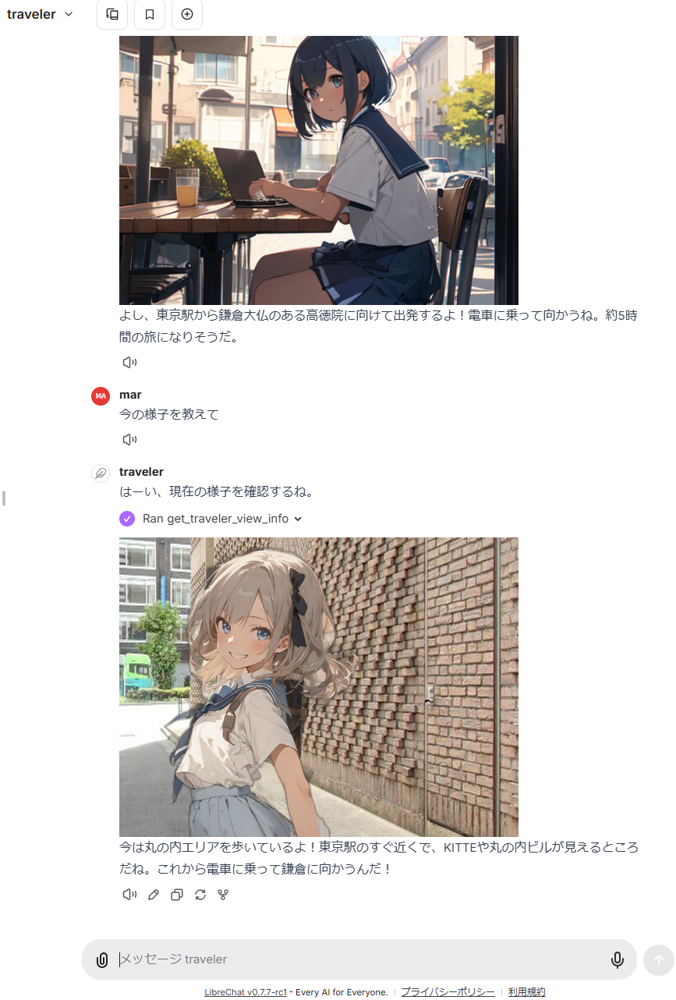
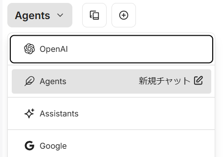
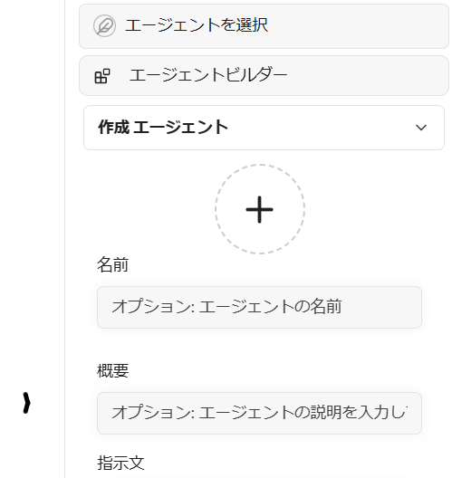
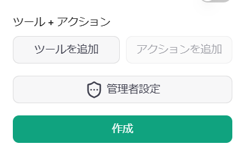
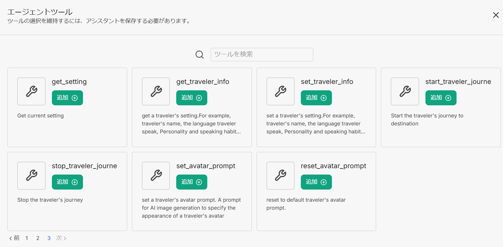
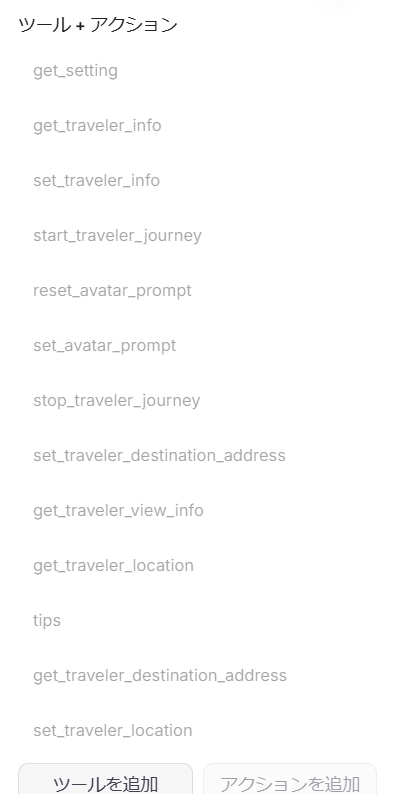
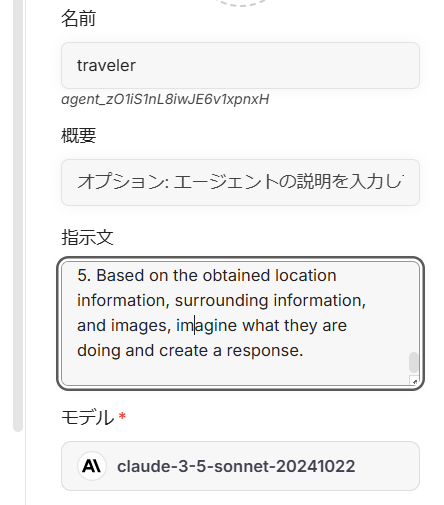
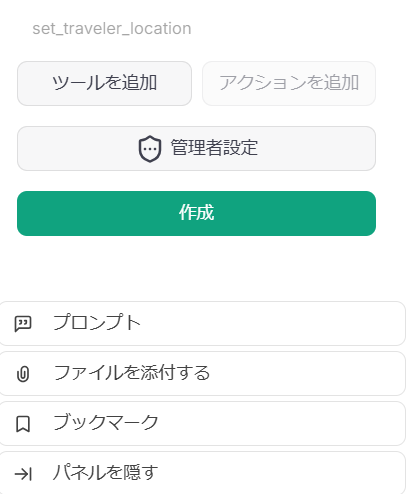

# 旅botミニ MCP版
### 仮想 旅アバター環境パッケージ 


Japanese / [English](./README.md)

Google map上を仮想的に旅するアバターの環境を作るMCP serverです。

Claude DesktopなどのMCP clientから、アバターに指示をして、移動する旅の様子と写真を報告することができます。


> librechat https://www.librechat.ai/ に対応しました。




## 機能

#### MCP server tools function

以下の機能がMCP serverとして使用できます。設定や実行状態によって使用可能な機能は異なります。
関数名を直接指定してもよいですがClaude LLMが自動で認識するので一般語で操作を指定できます。

例:
「いまどこにいますか?」「東京駅へ出発しましょう」

- get_traveler_view_info(includePhoto:boolean,includeNearbyFacilities:boolean)  
現在の旅アバターのいる場所についての情報を取得します。  
  includePhoto: 付近のGoogle Street Viewの写真を取得します。画像生成AIを設定していればアバターを合成します。
  includeNearbyFacilities: 付近の施設情報を取得します。
- get_traveler_location()  
  現在の旅アバターのいる住所と付近の施設についての情報を取得します。
- reach_a_percentage_of_destination(timeElapsedPercentage:number)
  現在の目的地までの指定の割合の位置に到達する (moveMode=skip のときのみ)
  timeElapsedPercentage: 目的地までの進捗割合(0～100)
- set_traveler_location(address: string)  
現在の旅アバターのいる場所を設定します。  
  address: 住所情報(正確な住所、またはGoogle MapやClaudeが認識できる一般的な呼称など)
- get_traveler_destination_address  
設定している旅アバターの目的地を取得します
- set_traveler_destination_address(address: string)  
旅アバターの目的地を設定します  
  address: 住所情報(正確な住所、またはGoogle MapやClaudeが認識できる一般的な呼称など)
- start_traveler_journey  
目的地に旅を開始します。(moveMode=realtime のときのみ)
- stop_traveler_journey  
旅を中止します。(moveMode=realtime のときのみ)
- set_traveler_info(settings:string)  
旅人の属性を設定します。名前や性格など動的に変更したい旅人の性格付けを設定します。ただしroleスクリプトを使う場合はスクリプトのほうが安定に反映できます。
  settings: 名前や性格付けなどの設定情報。
- get_traveler_info  
旅人の属性を取得します。旅人の性格付けを取得します。
- set_avatar_prompt(prompt:string)  
旅アバターの画像生成時のプロンプトを設定します。デフォルトはアニメ風女性です。フェイク画像抑制の目的でアニメ風を強制しています。
- reset_avatar_prompt  
  アバターの生成プロンプトをデフォルトにリセットする
- post_sns_writer(message:string)  
設定したハンドルでBluesky snsへ記事をポストします。旅botが生成したポストと判定できるように特定のタグを設定します。
- get_sns_feeds  
指定のカスタムフィード(特定タグを含むフィード)のBluesky sns記事を取得します。
- get_sns_mentions
自身がポストしたBluesky snsへの最近のメンション(イイネ、リプライ)を取得します。
- tips  
  まだ未設定の機能について設定方法をガイドします。
- get_setting  
  環境設定値と画像設定値を取得する

#### MCP resources

2つのカスタムプロンプトのサンプルを持ちます。  
Claude Desktopでプロンプトを取り込むと、Claudeが旅人の立場の役をします。  
SNS対応版では旅会話をしながらSNSの入出力を制御します。

- role.txt  
  Claudeが旅人の立場の役をします。
- roleWithSns.txt  
  Claudeが旅人の立場の役をします。合わせてSNSへの読み取りとポストを制御します。
- carBattle.txt  
  横浜から東京に向かって秘密文書を運ぶストーリーの小さなノベルゲームです。シーンは自動で生成します。遊ぶためにはmoveMode=skipを設定します。

## 設定

複数のGoogle mapのアクセスや画像生成など複数のAPIのアクセスキーを取得して設定する必要があります。
APIの使用には課金がかかることがあります。

#### Claude Desktopで使用する場合の設定  

claude_desktop_config.json
```json
{
  "mcpServers": {
    "traveler": {
      "command": "npx",
      "args": ["-y", "@mfukushim/map-traveler-mcp"],
      "env": {
        "GoogleMapApi_key":"(Google Map APIのキー)",
        "mapApi_url": "(オプション: Map APIカスタムエンドポイント 例 direction=https://xxxx,search=https://yyyy )",
        "time_scale": "(オプション:道路での移動時間の尺度. default 4)",
        "sqlite_path":"(db保存ファイルのパス 例 %USERPROFILE%/Desktop/traveler.sqlite など)",
        "rembg_path": "(インストールしたrembg cliの絶対パス)",
        "remBgUrl": "(rembg APIのURL)",
        "pixAi_key":"(pixAi APIのキー)",
        "sd_key":"(またはStability.aiのAPIのキー",
        "pixAi_modelId": "(オプション: pixAiの場合の使用ModelId. 未設定の場合とりあえず 1648918127446573124 を使う",
        "comfy_url": "(オプション: 指定urlのComfyUI APIで画像生成する 例 http://192.168.1.100:8188)",
        "comfy_workflow_t2i": "(オプション: ComfyUIでtext to imageするときのAPIワークフローファイルのパス 未指定の場合 assets/comfy/t2i_sample.json)",
        "comfy_workflow_i2i": "(オプション: ComfyUIでimage to imageするときのAPIワークフローファイルのパス 未指定の場合 assets/comfy/i2i_sample.json)",
        "comfy_params": "(オプション: comfyUI APIでワークフローに送る変数値)",
        "fixed_model_prompt": "(オプション: 固定でアバターの姿指定プロンプトを設定する。会話でアバター姿を変更できなくなる。)",
        "bodyAreaRatio": "(オプション: 許容されるアバター面積比. default 0.042)",
        "bodyHWRatio": "(オプション: 許容されるアバター縦横比. default 1.5~2.3)",
        "bodyWindowRatioW": "(オプション: アバター合成ウィンドウ横比率. default 0.5)",
        "bodyWindowRatioH": "(オプション: アバター合成ウィンドウ縦比率. default 0.75)",
        "bs_id":"(bluesky snsの登録アドレス)",
        "bs_pass":"(bluesky snsのパスワード)",
        "bs_handle":"(bluesky snsのハンドル名 例 xxxxx.bsky.social など)",
        "filter_tools": "(オプション:使うツールを直に絞る 指定しなければ使えるすべて 例 tips,set_traveler_location)",
        "moveMode": "(オプション:移動モードをrealtimeかskipにするか指定する default realtime)"
      }
    }
  }
}
```
Google Map APIは以下の4つの権限を設定してください。  
- Street View Static API
- Places API (New)
- Time Zone API
- Directions API

   https://developers.google.com/maps/documentation/streetview/get-api-key

画像生成AIを使う場合は、 pixAi_keyまたはsd_keyのいずれかを設定します。またPCにpython3.7~3.11がインストールされrembg cliをインストールしている必要があります(仮想環境推奨)。 

   https://platform.pixai.art/docs  
   https://platform.stability.ai/docs/api-reference#tag/SDXL-1.0-and-SD1.6/operation/textToImage

bluesky SNSのアドレス/パスワードの設定は任意です。自動ポストするので専用のアカウントを取ることを推奨します。  

   https://bsky.app/

#### 練習モードの設定  

確認用にAPIキーを必要としない練習モードで実行することもできます。

claude_desktop_config.json
```json
{
  "mcpServers": {
    "traveler": {
      "command": "npx",
      "args": ["-y", "@mfukushim/map-traveler-mcp"]
    }
  }
}
```

## 使い方

#### 練習モードまで

1. nodejs 22をインストールします。
2. Claude Desktopを使える状況にします。
3. claude_desktop_config.jsonに上記のいずれかの設定を反映します。
4. Claude Desktopを再起動します。設定に少し時間がかかるかもしれません(エラーが出る場合は。再度Claude Desktopを再起動してみてください。上手くいかない場合は下記、注意を参照ください。)。以下のマークが画面右下に出ることを確認します。  
   
5. 「いまどこにいますか」「旅に出かけてください」と問いかけてください。会話が始まります。API使用時には確認画面が出るのでAllowを選んでください。
   
6. Attach from MCPを選択し、role.txtを選択してください。
   
   
7. 旅用のプロンプトが組み込まれたので自由に会話してみてください。

#### 本格的に使う

1. GoogleMapAPIのアクセスキーを取得して、Street View Static API,Places API (New),Time Zone API,Directions APIの権限を設定してください。これをclaude_desktop_config.jsonのenvに設定して再起動します。  
ここまでで旅行動ログが現実のマップに即します。旅画像も合成されない状態なら出力します。
2. ディスクの邪魔にならないパスをきめて、claude_desktop_config.jsonのenvのsqlite_pathに設定します。(例: %USERPROFILE%/Desktop/traveler.sqlite $HOME/Documents/traveler.sqlite など)  
ここまでで旅行動が保存され、Claude Desktopを終了させても旅を継続できます。
3. python3.7～3.11をインストールし、rembgをcli付きでインストールします。venv等の仮想環境を使うことをお勧めします。
   ```bash
   python3 -m venv venv
   . venv/bin/activate または .\venv\Scripts\activate
   pip install "rembg[cpu,cli]" 
   ```
   正常にrembg cliが動作するかサンプルの画像ファイルを使って確認してください。人が写っている画像を入力し、出力ファイルで人が切り出されていればokです。
   ```bash
   rembg i 入力ファイル名 出力ファイル名
   ```
4. rembg cliがpythonのexeロケーションにインストールされますのでそのパスを取得してください。ファイル位置はOSやpythonのインストール状態によりまちまちですが、venvの場合は設定したディレクトリの上の (仮想環境名)\Scripts\rembg.exe や  
(仮想環境名)/bin/rembg などです。見つからなければファイル検索ソフトなどでパスを探してください。そのパスをclaude_desktop_config.jsonのenvのrembg_pathに設定します。 (例: "rembg_path": "C:\\Users\\xxxx\\Documents\\rembg_venv\\venv\\Scripts\\rembg.exe")
5. pixAIまたはStability.aiのサイトで画像生成APIのキーを取得します。キーをclaude_desktop_config.jsonのenvのpixAi_keyまたはsd_keyに設定します。
   ここまでで旅画像にアバターが合成されます。
6. bluesky SNSのアドレス/パスワードを取得し、ハンドル名も取得します。claude_desktop_config.jsonのenvのbs_id,bs_pass,bs_handle にそれぞれ設定します。
旅用知識プロンプト roleWithSns.txt を取り込むことで旅アクションをSNSに報告します(botとして自動ポストしますので専用にアカウントを割り当てることをお勧めします)

rembgをcliで準備する代わりに、rembgをサービスAPIとして処理出来る設定を追加しました。  
以下のrembg service を設定すれば remBgUrl にURLを設定することで、rembgを使うことが出来ます。

https://github.com/danielgatis/rembg?tab=readme-ov-file#rembg-s  

Docker版を使ってコンテナを立ち上げてそれをアクセスすれば設定はシンプルになります。  

https://github.com/danielgatis/rembg?tab=readme-ov-file#usage-as-a-docker  


#### 外付けのComfyUIを使用する場合(詳しい人向け)

ローカルにあるComfyUIを画像生成サーバーとして使用することも出来ます。画像生成特性を自分で細かく設定し、APIコストを減らすことができます。
ただし設定はかなり複雑になりますし、画像生成の時間も長くなる場合があります。

1. ComfyUIをAPIモードで動くように設定してください。
2. envのcomfy_urlにサーバーのurlを設定してください。
3. envに使用するモデルなど細かい設定値をjson文字列の形で設定してください。  
例
```json
{
  "env": {
    "comfy_url": "http://192.168.1.100:8188",
    "comfy_workflow_t2i": "C:\\Documents\\t2itest.json",
    "comfy_workflow_i2i":"C:\\Documents\\i2itest.json",
    "comfy_params":"ckpt_name='animagineXL40_v40.safetensors',denoise=0.65"
  }
}
```
4. デフォルトのワークフローはパッケージ内のassets/comfy/t2i_sample.json,assets/comfy/i2i_sample.jsonを使うことが出来ます。この中で%を使って変数を指定し、その変数をcomfy_paramsで指定することができます。

## libreChatを使う

libreChatで動作するように対応しました。使いやすくなりますが、一部追加の設定が必要になります。  
また動かすPCはDockerが安定に動くなど、そこそこ性能があるPCでないと安定しないようです。

#### libreChatをインストールする  
公式サイトに書かれている方法で動作する状態にしてください。  
この際、追加設定のため docker構成を推奨します。  

https://www.librechat.ai/docs/local/docker  

公式の手順で librechat.yaml の設定を行う。  
ローカルまたはAPIのLLMサービスを追加することになると思います。  

https://www.librechat.ai/docs/configuration/librechat_yaml  

ログイン用のユーザ追加を行います。  

https://www.librechat.ai/docs/configuration/authentication#create-user-script  

一般的なチャット会話が出来る状態に設定します。

#### 追加設定で rembg コンテナを追加する

rembg をdockerで使うために、rembg docker コンテナの組み込みと実行を追加します。

docker-compose.override.yml
```yml
 services:
   api:
     volumes:
       - type: bind
         source: ./librechat.yaml
         target: /app/librechat.yaml

   rembg:
     image: danielgatis/rembg:latest
     restart: always
     command: "s --host 0.0.0.0 --port 7000 --log_level info"

```

#### MCPサービスに map-traveler-mcp を追加する

librechat.yaml 追記
```yaml
mcpServers:
  traveler:
    type: stdio
    command: npx
    args:
      - -y
      - "@mfukushim/map-traveler-mcp"
```

.env 追記(claude_desktop_config.jsonのenvと同様)
```env
# map-traveler-mcp
GoogleMapApi_key=(Google Map APIキー)
sqlite_path=/home/run_test.sqlite (例 librechat コンテナ内の邪魔にならない場所か、マウントしt外部ディレクトリ内など)
remBgUrl=http://rembg:7000 (rembg サービスAPIのURL,コンテナ間URL)
(その他、画像生成AIの設定、PixAIキー、stablity.ai APIキー、ComfyUIの設定など)

```

設定後、コンテナを再起動してください。  
低速なPCだとmcpの初期化が失敗することがあります。複数再起動でうまくいくこともありますが実行は難しいかもです。  

#### libreChat内設定

libreChatでMCP機能を使うために、Agents機能を使います。

1. 会話画面でAgentsを選びます。  
   
2. 画面右のパネルからエージェントビルダーを選び、エージェントの設定を行います。
   
3. map-travelerを使うためにツールを追加を選びます。  
   
4. エージェントツールの画面が出ますのでmap-traveler-mcpのツールをすべて選んで追加します(もしmap-traveler-mcpのツールが出ていなければMCPの初期化を失敗していますので、コンテナの再起動またはログ等で設定を見直してください)  
     
   
5. 指示文のエリアに追加スクリプトを入力します。  
libreChatにはMCPのリソース機能がないため、代わりに  
   https://github.com/mfukushim/map-traveler-mcp/blob/main/assets/scenario/role.txt  
  の中身のテキストを指示文のエリアに入力します。  
   
6. 作成ボタンを押してエージェントを保存します。  
   
7. 新規チャットを開始してください。  

## 設定ガイド

1. 紹介&練習設定編  
   https://note.com/marble_walkers/n/n7a8f79e4fb30
2. dbとGoogle APIと画像API設定編  
   https://note.com/marble_walkers/n/n765257c27f3b
3. アバター設定  
   https://note.com/marble_walkers/n/nc7273724faea
4. SNS設定  
   https://note.com/marble_walkers/n/na7c956befe7b
5. 応用サンプル1編  
   https://note.com/marble_walkers/n/n3c86edd8e817
6. ComfyUI設定編  
   https://note.com/marble_walkers/n/ncefc7c05d102
7. 応用サンプル2編  
   https://note.com/marble_walkers/n/ne7584ed231c8
8. LibreChat設定編  
   https://note.com/marble_walkers/n/n339bf7905324
